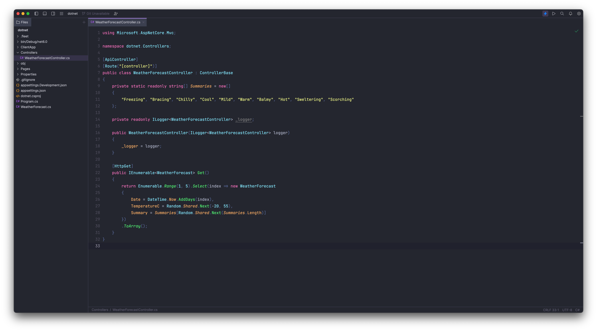

# (WIP) Dracula for [Fleet](https://www.jetbrains.com/fleet/)

> A dark theme for [Fleet](https://www.jetbrains.com/fleet/).

## Install

Linux: `/home/user_directory/.fleet/themes`

MacOS: `/Users/user_directory/.fleet/themes`

Windows: `C:\Users\user_directory\.fleet\themes`

1. Copy `dracula.json` to the path noted above that corresponds to your operating system.

## Team

This theme is maintained by the following person(s) and a bunch of [awesome contributors](https://github.com/dracula/template/graphs/contributors).

|  |
| --------------------------------------------------------------------------------------- |
| [Chris van Dal](https://github.com/cvandal)                                             |

## Community

* [Twitter](https://twitter.com/draculatheme) - Best for getting updates about themes and new stuff.
* [GitHub](https://github.com/dracula/dracula-theme/discussions) - Best for asking questions and discussing issues.
* [Discord](https://draculatheme.com/discord-invite) - Best for hanging out with the community.

## License

[MIT License](./LICENSE)
